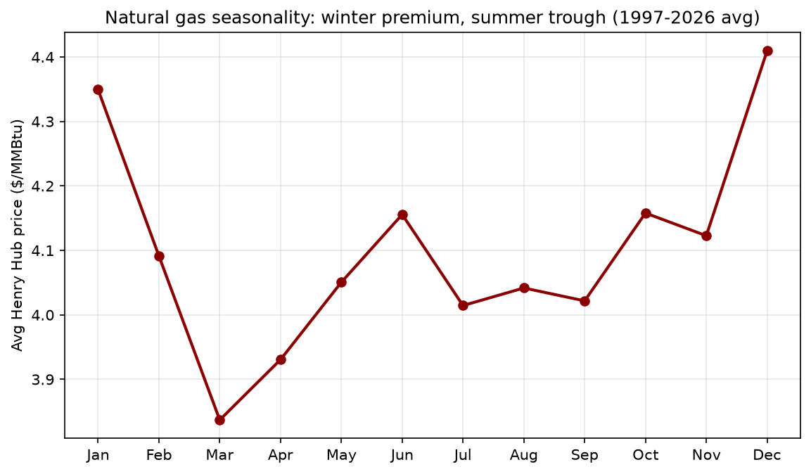
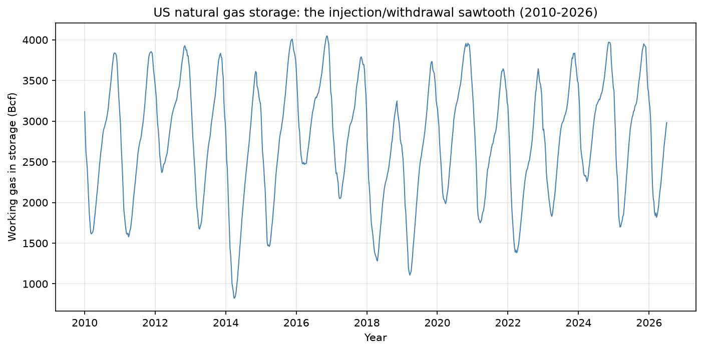
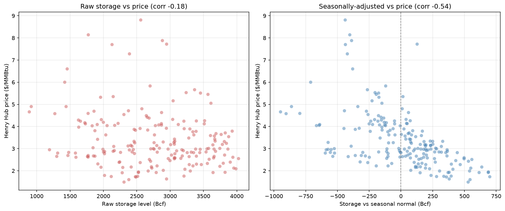
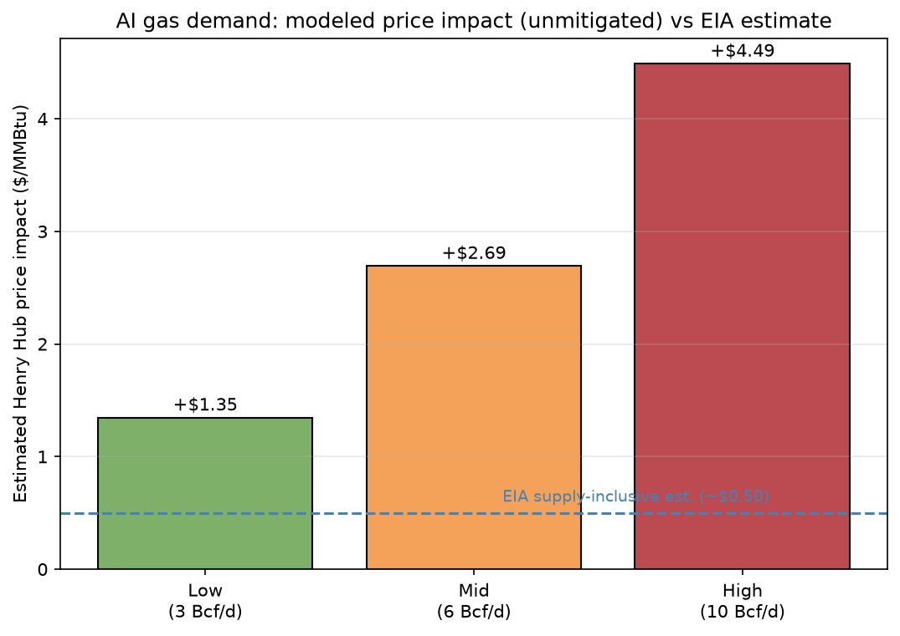

# Gas Markets & the AI Demand Shock

*A data-driven look at how US natural gas is priced — seasonality, storage, and the storage–price relationship — and a bottom-up model of what year-round AI data-center demand could do to gas prices. I built this to learn how gas markets actually work and to develop a defensible view on a genuinely current question.*

**Tools:** Python, pandas, matplotlib, numpy (linear fit).
**Data:** EIA Henry Hub spot prices (monthly, 1997–2026), EIA Weekly Working Gas in Underground Storage (2010–2026).

---

## The question

Natural gas has a strong seasonal rhythm and a storage system built around it. AI data centers are now adding a large, *year-round* source of gas demand on top of that seasonal pattern. I wanted to answer two things: how does the gas market normally work (seasonality, storage, price formation), and what does a constant new demand source do to it?

---

## What I found

**1. Gas seasonality is real but gentle on a long average.** Averaging Henry Hub prices by month (1997–2026) shows the expected winter premium and summer trough — December/January peak, late-winter/summer low. Averaging ~30 years smooths out the violent single-year spikes, so the *average* seasonal swing (~15%) understates any individual year's move.

**2. Storage runs a yearly injection/withdrawal sawtooth.** Weekly storage data (2010–2026) shows the cycle clearly: storage builds all summer (injection) and drains all winter (withdrawal), peaking ~November and bottoming ~March. Deviations from the normal cycle mark market stress — the deep 2014 trough is the polar-vortex winter.

**3. Storage *relative to normal* predicts price; the raw level doesn't.** The raw storage–price correlation is weak (**-0.18**), because absolute storage is dominated by the seasonal cycle. But storage measured *relative to its seasonal normal* correlates **-0.54** with price — a clear inverse relationship. This matches how traders actually read the EIA storage report: the "vs 5-year average" deviation matters far more than the absolute number.

**4. AI demand could materially tighten the market.** Using analyst forecasts for AI-driven gas demand (3 / 6 / 10 Bcf/d scenarios by 2030), I modeled the effect: year-round AI demand burned during the summer injection season is gas that doesn't get stored, thinning the cushion. Run through the -0.54 storage–price relationship, that implies a Henry Hub impact of **+$1.35 to +$4.49/MMBtu** in an *unmitigated* case.

That range runs hotter than EIA's supply-inclusive estimate (~+$0.50/MMBtu), and deliberately so: my model is a linear extrapolation that ignores supply response (higher prices pull in more production). It's best read as an **upper bound**. The honest conclusion: the direction and materiality are clear and agreed on across sources, even if the exact magnitude depends on how fast supply reacts.

---

## Method

**Seasonality:** grouped monthly Henry Hub prices by calendar month across all years to isolate the seasonal shape.

**Storage:** aggregated weekly EIA storage to monthly, then built a "storage vs seasonal normal" measure (each month's storage minus the average for that same month across years) — the deseasonalized tightness signal.

**Storage–price link:** correlated both raw storage and the deseasonalized measure against price, then fit a line (`numpy.polyfit`) to get the slope in $/MMBtu per Bcf.

**AI demand model:** converted each demand scenario (Bcf/day) into an injection-season storage shortfall (× ~214 days), then translated that shortfall into a price impact via the regression slope, and sanity-checked against EIA's independent figure.

Sources and assumptions are documented in [`assumptions.md`](assumptions.md).

---

## Caveats

- **The AI price-impact model is an upper bound.** It assumes the full storage shortfall persists and translates linearly through the historical slope, ignoring supply response, demand shifting, and non-linearity at the extremes. EIA's supply-inclusive figure (~$0.50/MMBtu) is lower for exactly this reason.
- **AI gas-demand forecasts are genuinely contested** — analyst estimates for 2030 span ~2–20 Bcf/d. I model a low/mid/high range rather than a point forecast.
- **The seasonal average understates single-year swings**, since averaging many years blends mild and severe winters.
- **Correlation is not causation** — storage tightness explains part of price behavior (-0.54), not all of it; weather, production, and demand shocks fill the rest.

---

*Built as a portfolio project — a real analysis of gas-market fundamentals, and a way to build fluency in how energy prices form (seasonality, storage, the futures curve).*
