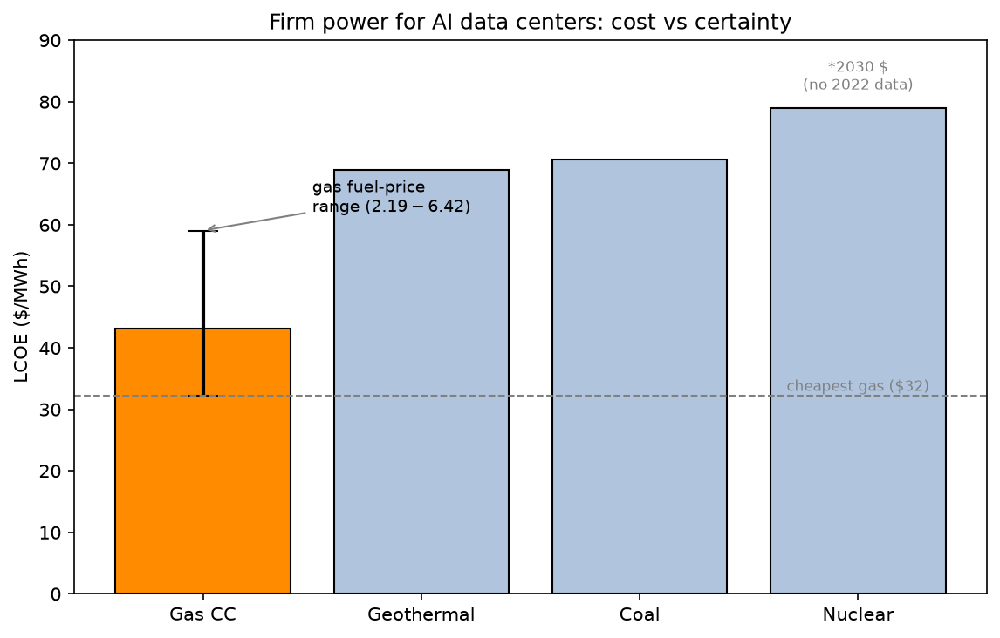
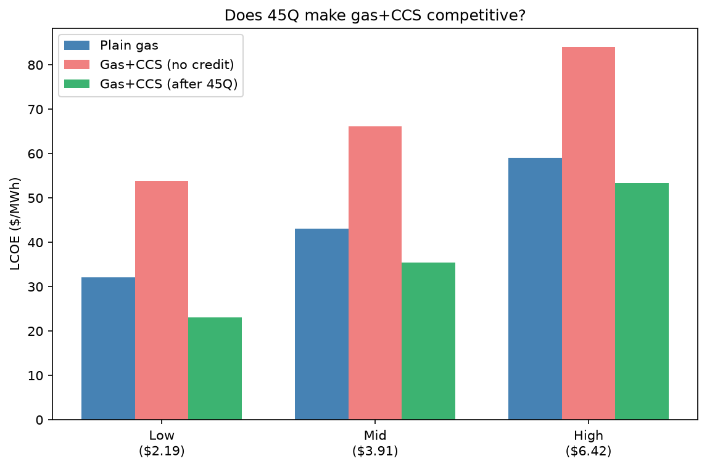
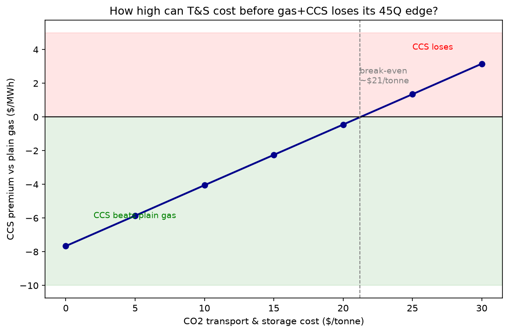

# Powering AI: The Energy Economics of the Data Center Boom

*A hands-on analysis of what it costs to power an AI data center with firm, 24/7 electricity — comparing gas, nuclear, geothermal, and coal, and testing whether the 45Q tax credit makes carbon capture worth building. I built this to work through the energy economics and the data tools at the same time.*

**Tools:** Python, pandas (data extraction & analysis), matplotlib (charts), Git/GitHub.
**Data:** NREL ATB 2024 (cost & performance), EIA Henry Hub (gas prices).

---

## Overview

AI data centers need enormous amounts of power, and they need it 24/7 — servers don't pause for the night or a calm, windless day. That rules out running them on solar or wind alone and puts the focus on *firm* power: sources that deliver reliably around the clock. I wanted to answer a simple question: if you're powering a new AI data center, what does each firm-power option actually cost per megawatt-hour — and how do policies like the 45Q carbon-capture tax credit change the ranking? It's a live question: hyperscalers like Microsoft and Google are signing nuclear and gas deals right now, and the economics behind those choices are what I set out to work through here.

The core metric I use is **LCOE** (levelized cost of energy) — the all-in cost per MWh over a plant's life, accounting for capital, fuel, operations, and the time value of money.

---

## Key findings

**1. Gas is cheapest, but its cost is a moving target.** I found a gas combined-cycle plant runs $32–59/MWh depending on fuel price. That entire spread is gas price volatility — the plant is identical, only the fuel cost changes. Geothermal ($69), coal ($71), and nuclear ($79) come out higher but *flat*: no fuel exposure, so their cost is locked in for the plant's life. The trade-off I kept coming back to isn't just "cheapest" — it's cheap-but-uncertain (gas) vs. pricier-but-certain (everything else).



**2. The 45Q credit flips gas+CCS from uneconomic to competitive.** Adding carbon capture roughly doubles a gas plant's capital cost, which pushed its LCOE ~$22–25/MWh above plain gas in my numbers. But the 45Q credit ($85/tonne of captured CO₂, which works out to ~$30/MWh here) more than covers that gap — on paper, gas+CCS ends up *cheaper* than plain gas across every scenario I ran.



**3. Whether CCS actually wins depends on location.** The catch I ran into: NREL's CCS costs exclude CO₂ transport & storage (T&S), and the credit only runs 12 of the plant's 30 years. When I swept T&S cost, gas+CCS kept its edge only below **~$21/tonne**. Real T&S runs $2–15/tonne where geology is good (Gulf Coast, Illinois) but $40+/tonne where it isn't (the Northeast). So the honest verdict I landed on is location-dependent, not a flat yes/no.



---

## Method

For **cost & performance data** I used the NREL Annual Technology Baseline (ATB) 2024 — CAPEX, fixed/variable O&M, capacity factor, and heat rates, in real 2022 dollars.

I built the **LCOE engine** (`src/lcoe.py`) from scratch — implementing the ATB formula for capital recovery factor, fixed charge rate, and full LCOE — and checked it against NREL's own published PV sample, matching to within ~2%, which told me the math was right.

I **assembled the fossil LCOEs manually**, because ATB leaves them blank by design: fuel price and dispatch (capacity factor) are user inputs. For gas fuel cost I used three EIA Henry Hub scenarios anchored to real years — $2.19 (2024 low), $3.91 (2021 mid), $6.42 (2022 crisis) — converted to $/MWh via plant heat rate. I assumed baseload capacity factors and documented them.

For **the 45Q analysis** I converted the $85/tonne credit into a $/MWh offset using each plant's CO₂ emissions per MWh, then tested the result against transport & storage cost and the 12-year credit window.

Every assumption and data quirk I hit is logged in [`assumptions.md`](assumptions.md).

---

## Caveats & limitations

I'll be upfront: this is a focused LCOE comparison, not a full techno-economic analysis. The limitations I'm aware of:

- **LCOE is a busbar cost** — I exclude transmission, distribution, and interconnection, which are often the real bottleneck for data-center siting (and a reason hyperscalers co-locate generation).
- **CCS costs exclude CO₂ transport & storage** (an ATB convention) — I handled this with the break-even sweep rather than a single point estimate.
- **I apply the 45Q credit at its flat $85/tonne value**, treated as real dollars; the 12-year window vs. 30-year plant life is addressed in the sensitivity, not levelized exactly.
- **ATB scenarios are innovation scenarios, not forecasts.** I used 2030 nuclear costs (2022 is blank in this ATB copy), and a textbook coal heat rate due to a units quirk in the source sheet.
- **Real 2022 dollars throughout** — I kept the real/nominal discipline consistent (gas price scenarios treated as real).

---

## Repo structure

```
├── src/
│   └── lcoe.py              # the LCOE engine I built (crf, fcr, lcoe)
├── data/
│   ├── raw/                 # NREL ATB workbook, EIA gas prices (untouched)
│   └── processed/           # cleaned outputs, comparison tables
├── figures/                 # the three charts
├── analysis.ipynb           # my working notebook (extraction → analysis)
├── assumptions.md           # every assumption and data quirk I documented
└── README.md
```

---

## Running it

```bash
python -m venv .venv
.venv\Scripts\activate          # Windows (use source .venv/bin/activate on Mac/Linux)
pip install -r requirements.txt
```

Then open `analysis.ipynb`. The LCOE engine is importable on its own:

```python
from src.lcoe import lcoe
```

---

*I built this as a portfolio project — a genuine analysis, and a way to learn the energy stack and Python data tools end to end.*
